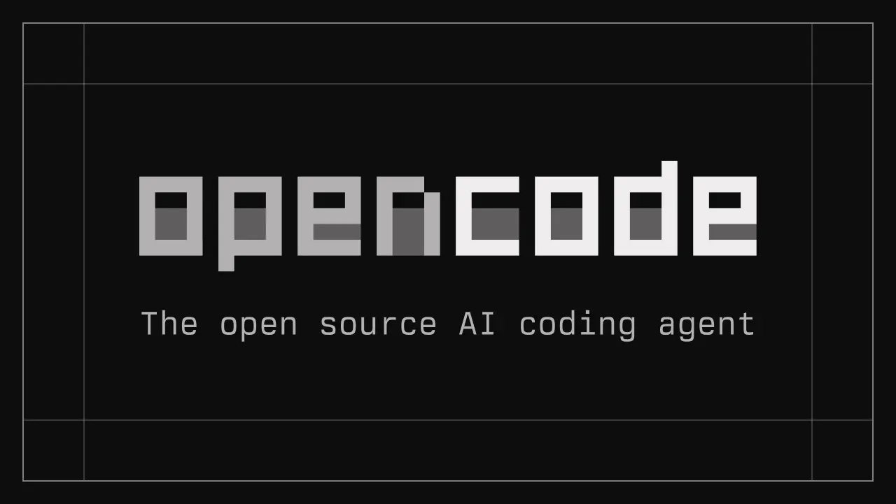
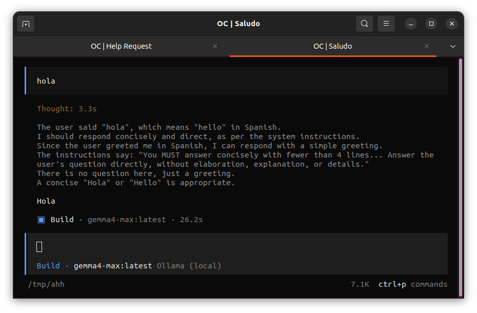
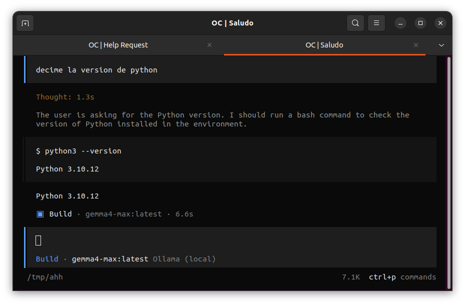

## Arquitectura de un LLM

```

                               [ Text Input ]
                                      │
                                      ▼
+-------------------------------------------------------------------------------+
|                                                                               |
|                             PREFILL / ENCODING                                |
|                                                                               |
+-------------------------------------------------------------------------------+
                                      │
                                      ▼
+-------------------------------------------------------------------------------+
|                                                                               |
|                           TRANSFORMER / ATTENTION                             |
|                                                                               |
+-------------------------------------------------------------------------------+
                                      │
                                      ▼
+-------------------------------------------------------------------------------+
|                                                                               |
|                        AUTOREGRESSIVE GENERATION                              |
|                                                                               |
+-------------------------------------------------------------------------------+
                                      │
                                      ▼
                               [ Text Output ]
```
---


## PREFILL / ENCODING : Word2Vect (2013) $\mathbb{R}_{300}$

```

Gender Vector ──>
        
         Man  ----------------------->  Woman
          │                               │
          │                               │
  Royal   │                               │  Royal
  Vector  │                               │  Vector
          │                               │
          ▼                               ▼
         King ---------------------->  Queen
        
                   Gender Vector ──>
```
---


# Stage 1: PREFILL / ENCODING : HOY

```
Raw Text: "Unbelievable speed"
           │
           ▼  (Tokenizer / Subword Splitting)
Tokens:   ["un", "believ", "able", " speed"]
           │
           ▼  (Vocabulary Lookup)
Token IDs: [2840,  19032,  1211,   4892]
           │
           ▼
[ Semantic Token Lookup ]  +  [ Positional Encoding ]
  (Embedding Matrix W_e)         (Sinusoidal or RoPE)
           │                             │
           └──────────────┬──────────────┘
                          ▼
            Final Transformer Input Vector
```

---
<style scoped>
section {
  font-size: 25px;
}
</style>

### LLM Tokenizer Vocabulary Sizes & Embedding Dimensions

| Model              | Vocab Size   | Hidden Dim (d_model) |
|--------------------|--------------|----------------------|
| **GPT-4 / 5 / 6**  | ~200k        | ~12,288*             |
| **Gemini**         | ~256–262k    | ~3k–8k+*             |
| **Claude** (est.)  | ~15–65k*     | undisclosed          |
| **Llama 3.1 8B**               | 128k         | 4,096                |
| **Llama 3.1 70B**              | 128k         | 8,192                |
| **Llama 4**                    | ~202k        | ~5k–8k*              |
| **Qwen3 (7–32B range)**        | ~152k        | 3,584 – 8,192        |
| **Qwen3-Coder-Next**           | ~152k        | 2,048                |
| **Gemma 3 (1B → 27B)**         | ~256k        | 1,152 → 5,376        |
| **DeepSeek-V3 / Mistral Tekken** | ~129–131k  | ~2,560 – 7,168       |

---

# Transformers / attention
|  |  |  |
| :---: | :---: | :---: |

---

# Stage 2: Transformers / attention

```
  Input Vectors (from Stage 1 or previous layer)
                        │
                        ▼
       ┌─────────────────────────────────┐
       │   1. Multi-Head Attention       │  <── Tokens communicate with each other
       └─────────────────────────────────┘
                        │
                        ▼  ( + Residual Connection & Norm )
       ┌─────────────────────────────────┐
       │   2. Feed-Forward Network (FFN) │  <── Individual token processing & facts lookup
       └─────────────────────────────────┘
                        │
                        ▼  ( + Residual Connection & Norm )
                  [ REPEATS N ] 
                        │
                        ▼ 
         Output Vectors (to next layer)
```

---

## Stage 3: Autoregresive Inference

```
  Final Hidden State (Vector h_last from Stage 2)
                        │
                        ▼
       ┌─────────────────────────────────┐
       │ 1. Unembedding (LM Head Matrix) │  ── Converts vector (4096) to Logits (128k)
       └─────────────────────────────────┘
                        │
                        ▼
       ┌─────────────────────────────────┐
       │ 2. Softmax                      │  ── Converts Logits into Probabilities (0 to 1)
       └─────────────────────────────────┘
                        │
                        ▼
       ┌─────────────────────────────────┐
       │ 3. Sampling Strategies          │  ── Applies Temperature, Top-p, Top-k
       └─────────────────────────────────┘
                        │
                        ▼
               Selected Token ID
                        │
                        ├─────────────────────────────┐
                        ▼                             ▼
              Converted to Text Word          Appended back to Prompt
               (Appears on Screen)            (Fed back into Stage 1)

```

---


# Ciclo Autorregresivo:

```
Paso 1: "Hoy arranco la dieta pero vi unas"                     --> Genera: " facturas"
Paso 2: "Hoy arranco la dieta pero vi unas facturas"            --> Genera: " y"
Paso 3: "Hoy arranco la dieta pero vi unas facturas y"          --> Genera: " ya"
Paso 4: "Hoy arranco la dieta pero vi unas facturas y ya"       --> Genera: " fue"
Paso 5: "Hoy arranco la dieta pero vi unas facturas y ya fue"   --> Genera: " ."
Paso 6: "Hoy arranco la dieta pero vi unas facturas y ya fue ." --> Genera: "<EOS>"
```

---


### 1. Context (Context Window)
**What it is**  
The maximum number of tokens the model can “see” and process in a single request (prompt + conversation history + documents).  

1 token ≈ ¾ of an English word, so 1M tokens ≈ 750,000 words.

| Type          | Typical / Flagship numbers                          | Examples |
|---------------|-----------------------------------------------------|----------|
| **Closed**    | **1M – 1.05M** (standard for frontier)             | GPT-6 Astra/Sol/Luna: **1.05M**<br>Claude Fable 5.1 / Opus 5.5: **1M**<br>Gemini 3.x: **~1–1.05M** |
| **Open**      | **128k – 10M** (wide range)                        | Llama 4 Scout: **10M**<br>Llama 4 Maverick: **1M**<br>DeepSeek-V3/V4, Qwen3: **128k–1M** |

---

### 2. Cache (Prompt / Prefix Caching)
**What it is**  
A cost- and latency-saving feature. The provider stores the processed version of the **static beginning** of your prompt (system instructions, tools, long documents). Later requests that start with the same prefix only pay a discounted rate for the cached part.

- Typical discount on cached tokens: **90% off** (OpenAI GPT-6, Anthropic, Gemini) or 50–75% on older models.
- Minimum size to cache: usually 1,024+ tokens.
- Lifetime: 5–30 minutes (sometimes longer).
- Closed models have the most mature, automatic or easy-to-use caching.  
- Open models rely on the inference engine (vLLM, TensorRT-LLM, etc.) for KV-cache reuse; there is usually no “90% cheaper” API-style discount.

---

### 3. Parámeteros
- **Dense models**: all parameters are used for every token.  
- **MoE (Mixture-of-Experts)**: only a fraction (“active”) are used per token.

| Type          | Typical numbers (2026)                                      | Examples |
|---------------|-------------------------------------------------------------|----------|
| **Closed**    | **Not published** (rumored low-trillions total for flagships) | GPT-6 Astra, Claude Fable 5.1, Gemini 3.x — OpenAI/Anthropic/Google do not disclose exact counts |
| **Open**      | **Clearly published**                                       | Llama 4 Scout: **109B total / 17B active**<br>Llama 4 Maverick: **~400B total / 17B active**<br>DeepSeek-V3: **671B total / 37B active**<br>Qwen3 dense: 0.6B–32B; MoE variants larger |

---

# ¿Qué compró la FIUBA?


Servidor con 2 x mi210 (64Gb de ram) : 128GB Total

Corre 
* Gemma4 (Google)
* Qwen (Alibaba)

---

<style scoped>
section {
  font-size: 15px;
}
</style>

| Model                        | Generation     | BenchLM General | BenchLM Coding | Notes / Primary Advantage                          |
|------------------------------|----------------|-----------------|----------------|----------------------------------------------------|
| **GPT-6 Astra**              | Current        | **88.5**        | **74.0**       | Highest overall BenchLM score                      |
| **Claude Opus 5.5**          | Current        | **87.1**        | **83.1**       | Highest coding score on BenchLM                    |
| **Claude Fable 5 / 5.1**     | Current        | **83.0**        | **79.8**       | Very strong long-horizon agentic coding            |
| **Claude Sonnet 5.5**        | Current        | **80.5**        | **79.8**       | Excellent coding performance among Sonnets         |
| **GPT-6 Sol**                | Current        | **81.1**        | **62.7**       | Strong overall, solid coding                       |
| **GPT-5.6 Terra**            | Previous       | **72.6**        | **64.3**       | Decent coding for previous generation              |
| **Claude Opus 4.8**          | Previous       | **70.4**        | **62.2**       | Previous flagship                                  |
| **GPT-6 Luna**               | Current        | **66.5**        | **51.1**       | Lighter GPT-6 variant                              |
| **DeepSeek V4 Pro 0813**     | Current        | **64.0**        | **49.1**       | Best open-weight cost/performance                  |
| **Claude Sonnet 4.6**        | Previous       | **56.3**        | **46.9**       | Previous daily driver                              |
| **Gemma 4 26B A4B**          | Current        | **46.3**        | —              | Efficient open model                               |
| **Gemma 4 31B**              | Current        | **44.9**        | **35.5**       | Strong open generalist                             |
| **Qwen3.6-35B-A3B**          | Current        | **41.9**        | **36.2**       | Efficient MoE open model                           |
| **GPT-4.1**                  | Older          | **39.8**        | **23.0**       | Older baseline                                     |
---

## ¿Y cómo hay que hacer?


### 1. En el servidor (Tupac)

```bash
# Instalar Ollama
curl -fsSL https://ollama.com/install.sh | sh

# Elegir e iniciar el modelo
ollama run qwen3-coder-next
```
Abre un servicio web en el **puerto 11434**.

### 2. En tu máquina local

```bash
ssh -L 11434:localhost:11434 <servidor.tupac.gob.ar>
```

Podés usar el modelo localmente en:

`http://localhost:11434`

---

## ¿Y cómo se usa?

```python
import ollama

response = ollama.chat(model="qwen3-next:latest", messages=[
    {"role": "user", "content": 
    """ 
        Hola, estoy en una presentación de uso de LLM, 
        podés saludar y presentarte con el auditorio?
    """ 
    }
])

print(response.message.content)
```

<span style="font-size: 10px">¡Hola a todos! Bienvenidos a esta presentación sobre el uso de modelos de lenguaje de gran tamaño (LLM). Soy **Qwen**, un modelo de lenguaje de gran tamaño desarrollado por **Alibaba Cloud**. [...] blah blah blah [...] ¡estoy aquí para ayudarles. ¡Comencemos! 🚀</span>

---

# Un ejemplo mas interesante:
## Corrector automático

Requisitos:
* Enunciado.
* Solución de Referencia.
* Carpeta con las entregas de los alumnos.
* Rubrica de evaluacion (opcional)

---

### 1. Analizador Inicial (Upfront Analysis)

```python
PROMPT_ANALISIS = f"""
Basándote en la siguiente información de la materia:

=== ENUNCIADO ({filename_statement}) ===
{statement_text}

=== SOLUCIÓN DE REFERENCIA ({filename_reference}) ===
{reference_text}

=== RÚBRICA DE EVALUACIÓN ===
{rubric_text}

Genera una guía de corrección sintetizada que contenga:
1. LISTA DE INCISOS/REQUERIMIENTOS: Puntos obligatorios a resolver.
2. MÉTRICAS Y RESULTADOS DE REFERENCIA: Valores esperados (accuracy, MSE, etc.).
3. DETALLES TÉCNICOS CRÍTICOS: Métodos clave y estabilidad numérica.
"""

response = Settings.llm.complete(PROMPT_ANALISIS)
assignment_summary = str(response)

```
---

<!-- Scoped style to format the two columns -->
<style scoped>
.columns {
    display: grid;
    grid-template-columns: repeat(2, minmax(0, 1fr));
    gap: 1rem;
  }
  ul {
    font-size: 0.5rem;
    line-height: 1.25;
  }
  h2 {
    font-size: 20px;
    color: #1f2937;
    border-bottom: 2px solid #3b82f6;
    padding-bottom: 0.2rem;
    margin-bottom: 0.5rem;
  }
  section {
  font-size: 30px;
  line-height: 1.25;
  color: #333333;
  padding: 30px 40px;
}
h3 {
  font-size: 0.85rem;
  margin-top: 0.6em;
  margin-bottom: 0.3em;
  color: #555555;
  border-bottom: 1px solid #ddd;
}
table {
  font-size: 10px;
  margin-bottom: 0.5em;
  width: 100%;
}
th, td {
  padding: 3px 8px;
}
ul {
  margin-top: 0.2em;
  margin-bottom: 0.2em;
  padding-left: 1.2em;
}
li {
  margin-bottom: 0.2em;
}
p {
  margin: 0.2em 0;
}
</style>

<div class="columns">
<div>

## 1. LISTA DE INCISOS / REQUERIMIENTOS  

- **A. Exploración de Datos**
  - [ ] Filtrar dataset (`Type`, `Air temp`, `Torque`, etc.)
  - [ ] Proporciones de variables categóricas
  - [ ] Generar y explicar `pairplot` por clases
  - [ ] Conclusiones (correlaciones y predictores clave)
  - [ ] Split de datos (80% train / 20% test)

- **B. Preprocesamiento**
  - [ ] Codificación de `Type` (`OrdinalEncoder` con justificación $L < M < H$)
  - [ ] Mapa polinómico grado 2 sobre variables numéricas
  - [ ] Justificación teórica del n.º de columnas resultantes
  - [ ] Pipeline con `ColumnTransformer` y `StandardScaler`

- **C. Clasificación (Implementación)**
  - [ ] Justificación teórica del gradiente del riesgo regularizado
  - [ ] Clase `RegresionLogistica` (solo NumPy): `fit`, `predict`, métricas y regularización L2
  - [ ] Integración en `Pipeline` de scikit-learn
  - [ ] Curva de aprendizaje (convergencia del riesgo)
  - [ ] Reporte de métricas train/test ($\lambda = 0.1$)

- **D. Curva ROC y Calibración**
  - [ ] Implementación manual de ROC con `predict_proba`
  - [ ] Marcación de umbral original (0.5), EER y $F_1$-óptimo
  - [ ] Tabla comparativa de métricas por umbral
  - [ ] Justificación de la métrica clave para mantenimiento predictivo

</div>
<div>


## 2. MÉTRICAS Y RESULTADOS DE REFERENCIA

| Métrica / Dato | Valor Esperado (Aprox.) | Observación |
| --- | --- | --- |
| **Proporción Target** | $\approx 3.4\%$ Fallos / $96.6\%$ Funcionales | Dataset fuertemente desbalanceado. |
| **Proporción Type** | L: 60%, M: 30%, H: 10% | Variable categórica ordinal. |
| **Accuracy (th=0.5)** | $\approx 96\% - 97\%$ | Engañoso debido al desbalance de clases. |
| **Recall (th=0.5)** | Bajo ($\approx 23\%$) | El modelo tiende a predecir la clase mayoritaria. |
| **F1-Score (th=0.5)** | Bajo ($\approx 0.36$) | Indica necesidad de ajustar el umbral. |
| **EER** | $\approx 0.17$ | Punto donde FPR = FNR. |
| **F1-Score (Opt)** | $\approx 0.62$ | Mejora significativa tras ajustar el umbral ($\approx 0.20$). |
| **Cross Entropy** | $\approx 0.08 - 0.09$ | Indica que el modelo ha convergido bien. |


## 3. DETALLES TÉCNICOS CRÍTICOS

* **Estabilidad Numérica:** Es fundamental el uso de `np.clip(s, 1e-8, 1 - 1e-8)` en la función de riesgo para evitar $\log(0)$ que resulte en `NaN`.
* **Manejo del Bias en Regularización:** El término de regularización $L_2$ **no debe aplicarse al bias** ($\theta_0$). En el código, esto se refleja como `np.linalg.norm(self.theta_[1:])**2`.
* **Gradiente Correcto:** La expresión debe combinar la derivada de la Cross-Entropy con la derivada de la norma $L_2$:


$$\tiny \nabla J = \frac{1}{N} X^T(\sigma(X\theta) - y) + \frac{2\lambda}{N}\theta'$$


* **Estructura del Pipeline:** El flujo debe ser estrictamente: `ColumnTransformer` $\rightarrow$ `StandardScaler` $\rightarrow$ `LogisticRegression`.
* **Cálculo de ROC:** La curva se construye variando el umbral sobre las probabilidades predichas, calculando el TPR (Recall) y FPR para cada punto.
* **Dimensiones Polinómicas:** Para $d$ variables y grado $\nu=2$, la cantidad de columnas es: $\tiny \frac{(d+2)!}{d!\,2!} - 1$


</div>
</div>


---

### 2. Plantilla Invariante (System Message)

optimiza el cache.

```python
def build_system_prompt(assignment_summary: str) -> str:
    return f"""Eres un evaluador académico riguroso para la materia Taller de Procesamiento de Señales.
Tu tarea es evaluar la entrega de un estudiante comparándola estrictamente contra la Guía de Referencia.

==================================================
GUÍA DE CORRECCIÓN Y REFERENCIA (PRE-ANALIZADA):
{assignment_summary}
==================================================

INSTRUCCIONES DE CORRECCIÓN:
- Evalúa la entrega entregada en el mensaje del usuario.
- Sé estricto con los aspectos técnicos, vectorización y resultados.
- Devuelve el reporte siguiendo exactamente esta estructura:

# EVALUACIÓN: [Aprobado/Reentrega/Desaprobado] - [Puntaje]/100
## RESUMEN
[Una sola oración que resuma el desempeño general]
## REPORTE DETALLADO
- **1. Completitud:** ...
- **2. Comparación de Métricas:** ...
- **3. Bugs y Calidad de Implementación:** ...
"""
```
---
### 3. Payload de Evaluación por Alumno (User Message)

```python
def grade_submission(student_path: Path, system_prompt: str) -> str:
    student_text = load_notebook(student_path)

    # La estructura ChatMessage se mapea directamente al payload /api/chat
    messages = [
        ChatMessage(
            role=MessageRole.SYSTEM, 
            content=system_prompt
        ),
        ChatMessage(
            role=MessageRole.USER,
            content=(
                f"ENTREGA DEL ESTUDIANTE ARCHIVO: {student_path.name}\n\n"
                f"--- INICIO NOTEBOOK ---\n{student_text}\n"
                f"--- FIN NOTEBOOK ---"
            )
        )
    ]

    response = Settings.llm.chat(messages)
    return str(response.message.content)
```
---

### 4. Flujo General de Evaluación (1.5min por alumno)

```
                       [Enunciado + Ref. Solution]
                                    │
                                    ▼
                      1. PROMPT DE PRE-ANÁLISIS
                                    │
                                    ▼
                         [Guía de Referencia]
                                    │
                                    ▼
                    2. BUILD SYSTEM PROMPT (Estático)
                                    │
            ┌───────────────────────┴───────────────────────┐
            ▼                                               ▼
   [Alumno 1: Notebook]                            [Alumno 2: Notebook]
            │                                               │
            ▼                                               ▼
   3. SYSTEM + USER MSGS                           3. SYSTEM + USER MSGS
            │                                               │
            ▼                                               ▼
    Reporte Markdown                                Reporte Markdown

```
---
<style scoped>
.columns {
    display: grid;
    grid-template-columns: repeat(2, minmax(0, 1fr));
    gap: 1rem;
  }
section {
  font-size: 12px;
}
</style>
<div class="columns">
<div>

### EVALUACIÓN: Reentrega - 78/100

### RESUMEN
El estudiante demuestra un dominio sólido en la implementación matemática de la Regresión Logística y la construcción de pipelines, pero falla en requerimientos específicos de implementación manual (Curva ROC) y omite análisis teóricos y conclusiones críticas solicitadas en la guía.
### REPORTE DETALLADO
- **1. Completitud:**
    - **Exploración de Datos:** Realizó el filtrado, proporciones y pairplot. Sin embargo, **faltan las conclusiones basadas en la exploración** (no analiza correlaciones ni identifica variables predictoras clave, solo describe qué es un pairplot).
    - **Preprocesamiento:** Implementó el mapa polinómico y el pipeline. **Falta la justificación teórica de la cantidad de columnas resultantes** (solo imprime el número 21 sin explicar la fórmula combinatoria). Utilizó `OneHotEncoder` en lugar del recomendado `OrdinalEncoder`; aunque lo justifica, ignora la naturaleza ordinal ($L < M < H$) sugerida.
    - **Clasificación:** Implementación completa y correcta de la clase `RegresionLogistica`. Incluye todos los métodos obligatorios y la justificación teórica del gradiente es impecable.
    - **Curva ROC y Calibración:** **Incumplimiento crítico**: utilizó `sklearn.metrics.roc_curve` en lugar de realizar la **implementación manual** solicitada. Calculó correctamente el EER y optimizó el F1-score, pero **omitió la justificación de la métrica más relevante** para el mantenimiento predictivo (ej. importancia del Recall).
</div><div>

- **2. Comparación de Métricas:** 
  Los resultados numéricos son consistentes con la referencia, validando que el modelo converge correctamente:
    - **Accuracy (th=0.5):** $97.5\%$ (Ref: $96-97\%$) $\rightarrow$ **Correcto**.
    - **Recall (th=0.5):** $32.7\%$ (Ref: $\approx 23\%$) $\rightarrow$ **Correcto**.
    - **F1-Score (th=0.5):** $0.44$ (Ref: $\approx 0.36$) $\rightarrow$ **Correcto**.
    - **EER:** $0.177$ (Ref: $\approx 0.17$) $\rightarrow$ **Correcto**.
    - **F1-Score (Opt):** $0.547$ (Ref: $\approx 0.62$) $\rightarrow$ **Aceptable** (la diferencia se atribuye al uso de OneHot y la semilla aleatoria).
    - **Cross Entropy:** $0.085$ (Ref: $0.08-0.09$) $\rightarrow$ **Correcto**.

- **3. Bugs y Calidad de Implementación:**
    - **Estabilidad Numérica:** Excelente uso de `np.clip` para evitar `NaN` en el logaritmo.
    - **Regularización:** Implementación correcta del término L2; se observa que el bias ($b$) no es regularizado, cumpliendo estrictamente con la guía.
    - **Vectorización:** El código está correctamente vectorizado utilizando operaciones de numpy (`@` para producto punto), evitando bucles innecesarios en el cálculo del gradiente.
    - **Pipeline:** La estructura `ColumnTransformer` $\rightarrow$ `StandardScaler` $\rightarrow$ `RegresionLogistica` es correcta y profesional.

**Motivo de Reentrega:** El uso de una función de librería (`roc_curve`) para un ejercicio donde se exige explícitamente la implementación manual es un error conceptual en el marco de un Taller de Procesamiento de Señales. Asimismo, la falta de análisis crítico sobre las métricas de negocio y la justificación teórica de las dimensiones polinómicas penalizan la entrega.
</div>

---

# ¿ Y si dejamos que el LLM maneje la computadora?

```json
[TOOL_CALL]
{
  "tool": "weather_api",
  "parameters": {
    "location": "Tokyo",
    "units": "celsius"
  }
}
[/TOOL_CALL]
``` 

---
<style scoped>
.grid {
  display: flex;
  justify-content: space-between;
  width: 100%;
  margin-bottom: 20px;
}
.grid img {
  width: 28%;
  object-fit: contain;
}
</style>

# Agents

<div class="grid">
  
  
  
</div>

<div class="grid">
  
  
  
</div>

---
<style scoped>
.columns {
    display: grid;
    grid-template-columns: repeat(2, minmax(0, 1fr));
    gap: 1rem;
  }
</style>

# opencode.json

<div class="columns">
<div>

```json
{
  "$schema": "https://opencode.ai/config.json",
  "plugins": ["@opencode-trace/plugin"],
  "model": "ollama/gemma4-max:latest",
  "agent": {
    "build": {
      "steps": 25
    },
    "general": {
      "steps": 20
    }
  },
  "permission": {
      "websearch": "allow",
      "webfetch": "allow",
      "tools": "allow",
      "bash": {
        "*": "allow",
        "dotnet": "deny",
        "dotnet *": "deny"
      }
  },
  "lsp": true,
```

</div>
<div>

```json
  "provider": {
    "ollama": {
      "npm": "@ai-sdk/openai-compatible",
      "name": "Ollama (local)",
      "options": {
        "baseURL": "http://127.0.0.1:11434/v1"
      },
      "models": {
      "gemma4-max:latest": {
            "name": "gemma4-max:latest"
        }
      }
    }
  }
}
```

</div>
</div>

---



---



---
<style scoped>
.columns {
    display: grid;
    grid-template-columns: repeat(2, minmax(0, 1fr));
    gap: 1rem;
  }
</style>

# Estructura

<div class="columns">
<div>

```
my-project/
├── AGENTS.md
├── opencode.json
│
└── .opencode/
    ├── agents/
    │   ├── reviewer.md
    │   └── researcher.md
    │
    ├── skills/
    │   ├── python/
    │   │   └── SKILL.md
    │   └── latex/
    │       └── SKILL.md
    │
    └── commands/
        ├── review.md
        └── test.md
```
</div>

<div>


`.opencode/agents/reviewer.md:`

```
---
description: Reviews code for bugs
mode: subagent
---

You are a code reviewer.

Look for:
- Bugs
- Incorrect assumptions
- Missing error handling
- Tests that should be added

Do not modify files.
```

</div>

---
<style scoped>
.columns {
    display: grid;
    grid-template-columns: repeat(2, minmax(0, 1fr));
    gap: 1rem;
  }
</style>

<div class="columns">
<div>

`.opencode/skills/python/SKILL.md:`

```markdown
---
name: python
description: Python development guidelines
---

When writing Python:

- Use type hints.
- Prefer pathlib over os.path.
- Use pytest for tests.
- Follow PEP 8.
```
</div>

<div>

`.opencode/commands/review.md`

```markdown
---
description: Review the current code
---

Review the code in this project for bugs and
suggest concrete improvements.
```

</div>

---
<style scoped>
.columns {
    display: grid;
    grid-template-columns: repeat(2, minmax(0, 1fr));
    gap: 1rem;
  }
</style>

# Loops

<div class="columns">
<div>

``` python
import os, subprocess, time

os.chdir(os.path.dirname(__file__))

while True:
    r = subprocess.run(
        ["opencode", "run", "--attach", 
        "http://localhost:4096",
         "--continue", 
         "Continue "],
        capture_output=True, text=True)

    print(r.stdout)
    if "[FINISH]" in r.stdout:
        break

    time.sleep(2)
```
</div>
<div>


</div>

---